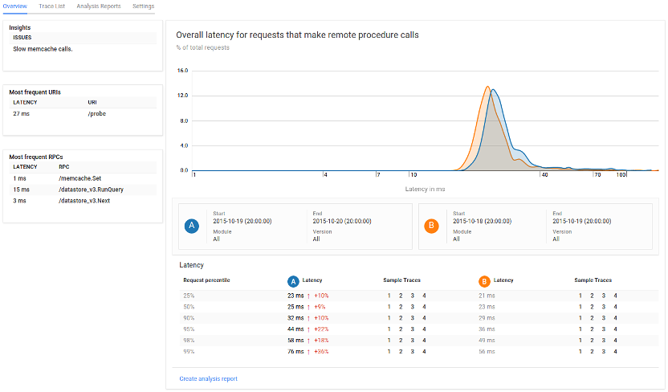

# Stackdriver Trace for Node.js

[![NPM Version][npm-image]][npm-url]
[![Build Status][travis-image]][travis-url]
[![Test Coverage][coveralls-image]][coveralls-url]
[![Dependency Status][david-image]][david-url]
[![devDependency Status][david-dev-image]][david-dev-url]
[![Known Vulnerabilities][snyk-image]][snyk-url]

> *This module is experimental, and should be used by early adopters. This module uses APIs that may be undocumented and subject to change without notice.*

This module provides Stackdriver Trace support for Node.js applications. [Stackdriver Trace](https://cloud.google.com/cloud-trace/) is a feature of [Google Cloud Platform](https://cloud.google.com/) that collects latency data (traces) from your applications and displays it in near real-time in the [Google Cloud Console][cloud-console].



## Prerequisites

1. Your application will need to be using Node.js version 4.0 or greater.
1. You will need a project in the [Google Developers Console][cloud-console]. Your application can run anywhere, but the trace data is associated with a particular project.
1. [Enable the Trace API](https://console.cloud.google.com/flows/enableapi?apiid=cloudtrace) for your project.

## Installation

1. Install with [`npm`](https://www.npmjs.com) or add to your [`package.json`](https://docs.npmjs.com/files/package.json#dependencies).

    ```sh
    # Install through npm while saving to the local 'package.json'
    npm install --save @google-cloud/trace-agent
    ```

2. Set the GCLOUD_PROJECT environment variable. You can find your Project ID in the [Google Cloud Developers Console][cloud-console], or by running the command `gcloud projects list`. You can ensure this environment variable is set at startup time by placing it in your startup script in `package.json`:

    ```json
    "scripts": {
      "start": "GCLOUD_PROJECT=<YOUR_PROJECT_ID> node server.js",
    },
    ```

3. Include and start the library *as the very first action in your application*:

    ```js
    var agent = require('@google-cloud/trace-agent').start();
    ```

  If you use `--require` in your start up command, make sure that the trace agent is --required first.

4. If you are running your application locally, or on a machine where you are using the [Google Cloud SDK][gcloud-sdk], make sure to log in with the application default credentials:
    ```sh
    gcloud beta auth application-default login
    ```

If you are running somewhere other than the Google Cloud Platform, see [running elsewhere](#running-elsewhere).

## Configuration

See [the default configuration](config.js) for a list of possible configuration options. These options can be passed to the agent through the object argument to the start command shown above:

```js
require('@google-cloud/trace-agent').start({samplingRate: 500});
```

Alternatively, you can provide configuration through a config file. This can be useful if you want to load our module using `--require` on the command line instead of editing your main script. You can start by copying the default config file and modifying it to suit your needs. The `GCLOUD_DIAGNOSTICS_CONFIG` environment variable should point to your configuration file.

## Running on Google Cloud Platform

There are three different services that can host Node.js applications within Google Cloud Platform.

### Google App Engine flexible environment

If you are using [Google App Engine flexible environment](https://cloud.google.com/appengine/docs/flexible/), you do not have to do any additional configuration.

### Google Compute Engine

Your VM instances need to be created with the `https://www.googleapis.com/auth/trace.append` scope if created via the [gcloud](https://cloud.google.com/sdk) CLI or the Google Cloud Platform API, or with the 'Allow API access' checkbox selected if created via the [console][cloud-console] (see screenshot).


If you already have VMs that were created without API access and do not wish to recreate it, you can follow the instructions for using a service account under [running elsewhere](#running-elsewhere).

### Google Container Engine

As with Compute Engine, Container Engine nodes need to be created with the `https://www.googleapis.com/auth/trace.append` scope, which is configurable during cluster creation:
* If the cluster is being created with the `gcloud` CLI, pass the scope to the command with the `--scopes` command (multiple scopes can be [delimited with a comma](https://cloud.google.com/sdk/gcloud/reference/container/clusters/create)):

  ```sh
  gcloud container clusters create example-cluster-name --scopes https://www.googleapis.com/auth/trace.append
  ```

* If the cluster is being created through the Cloud Console UI, ensure that the "Stackdriver Trace" project access is set to "Write Only" (this is the default).

Alternatively, you can also follow the instructions for using a service account under [running elsewhere](#running-elsewhere). It's recommended that you store the service account credentials as [Kubernetes Secret](http://kubernetes.io/v1.1/docs/user-guide/secrets.html).

## Running elsewhere

If your application is running outside of Google Cloud Platform, such as locally, on-premise, or on another cloud provider, you can still use Stackdriver Trace.

1. You will need to specify your project ID when starting the trace agent.

    ```sh
    GCLOUD_PROJECT=particular-future-12345 node myapp.js
    ```

2. You need to provide service account credentials to your application. The recommended way is via [Application Default Credentials][app-default-credentials].

  1. [Create a new JSON service account key][service-account].
  2. Copy the key somewhere your application can access it. Be sure not to expose the key publicly.
  3. Set the environment variable `GOOGLE_APPLICATION_CREDENTIALS` to the full path to the key. The trace agent will automatically look for this environment variable.

If you are running your application on a development machine or test environment where you are using the [`gcloud` command line tools][gcloud-sdk], and are logged using `gcloud beta auth application-default login`, you already have sufficient credentials, and a service account key is not required.
  
Alternatively, you may set the `keyFilename` or `credentials` configuration field to the full path or contents to the key file, respectively. Setting either of these fields will override either setting `GOOGLE_APPLICATION_CREDENTIALS` or logging in using `gcloud`. (See the [default configuration](config.js) for more details.)

## Viewing your traces

Run your application and start sending some requests towards your application. In about 30 seconds or so, you should see trace data gathered in the [STACKDRIVER -> Traces -> Trace List](https://console.cloud.google.com/traces/overview) in the console:


This is the trace list that shows a sampling of the incoming requests your application is receiving. You can click on a URI to drill down into the details. This will show you the RPCs made by your application and their associated latency:


## What gets traced

The trace agent can do automatic tracing of the following web frameworks:
* [express](https://www.npmjs.com/package/express) (version 4)
* [gRPC](https://www.npmjs.com/package/grpc)* server (version 1)
* [hapi](https://www.npmjs.com/package/hapi) (versions 8 - 16)
* [koa](https://www.npmjs.com/package/koa) (version 1)
* [restify](https://www.npmjs.com/package/restify) (versions 3 - 4)

The agent will also automatic trace of the following kinds of RPCs:
* Outbound HTTP requests through the `http` and `https` core modules
* [gRPC](https://www.npmjs.com/package/grpc)* client (version 1)
* [MongoDB-core](https://www.npmjs.com/package/mongodb-core) (version 1)
* [Mongoose](https://www.npmjs.com/package/mongoose) (version 4)
* [Redis](https://www.npmjs.com/package/redis) (versions 0.12 - 2)
* [MySQL](https://www.npmjs.com/package/mysql) (version ^2.9)

*Note: The latest versions of gRPC (versions 1.1 and up) have dropped support for Node.js <4.0. We do not support tracing gRPC on unsupported versions of Node.js.

You can use the [Custom Tracing API](#custom-tracing-api) to trace other processes in your application.

We are working on expanding the types of frameworks and services we can do automatic tracing for. We are also interested in hearing your feedback on what other frameworks, or versions, you would like to see supported. This would help us prioritize support going forward. If you want support for a particular framework or RPC, please file a bug or +1 an existing bug.

## Advanced trace configuration

The trace agent can be configured by passing a configurations object to the agent `start` method. This configuration option accepts all values in the [default configuration](config.js).

One configuration option of note is `enhancedDatabaseReporting`. Setting this option to `true` will cause database operations for redis and MongoDB to record query summaries and results as labels on reported trace spans.

### Trace batching and sampling

The aggregation of trace spans before publishing can be configured using the `flushDelaySeconds` and `bufferSize` [options](config.js). The spans recorded for each incoming requests are placed in a buffer after the request has completed. Spans will be published to the UI in batch when the spans from `bufferSize` requests have been queued in the buffer or after `flushDelaySeconds` have passed since the last publish, whichever comes first.

The trace configuration additionally exposes the `samplingRate` option which sets an upper bound on the number of traced requests captured per second. Some Google Cloud environments may override this sampling policy.

### Tracing Additional Modules

In addition to the modules listed [above](#what-gets-traced), the trace agent can be configured to trace additional modules through the use of *plugins*. To load an additional plugin, specify it in the agent's configuration:

```js
  require('@google-cloud/trace-agent').start({
    plugins: {
      // You may use a package name or absolute path to the file.
      'my-module': '@google-cloud/trace-agent-plugin-my-module',
      'another-module': path.join(__dirname, 'path/to/my-custom-plugins/plugin-another-module.js')
    }
  });
```

This list of plugins will be merged with the list of built-in plugins, which will be loaded by the plugin loader. Each plugin is only loaded when the module that it patches is loaded; in other words, there is no computational overhead for listing plugins for unused modules.

To create a plugin for a module, please see the [Plugin Developer Guide](doc/plugin-guide.md).

## Custom Tracing API

The custom tracing API can be used to add custom spans to trace. A *span* is a particular unit of work within a trace, such as an RPC request. Spans may be nested; the outermost span is called a *root span*, even if there are no nested child spans. Root spans typically correspond to incoming requests, while *child spans* typically correspond to outgoing requests, or other work that is triggered in response to incoming requests.

For any of the web frameworks for which we provide [built-in plugins](#what-gets-traced), a root span is automatically started whenever an incoming request is received (in other words, all middleware already runs within a root span). If you wish to record a span outside of any of these frameworks, any traced code must run within a root span that you create yourself.

### Accessing the API

Calling the `start` function returns an instance of `TraceApi`, which provides an interface for tracing:

```js
  var traceApi = require('@google-cloud/trace-agent').start();
```

It can also be retrieved by subsequent calls to `get` elsewhere:

```js
  // after start() is called
  var traceApi = require('@google-cloud/trace-agent').get();
```

A `TraceApi` object is guaranteed to be returned by both of these calls, even if the agent is disabled.

A fully detailed overview of the `TraceApi` object is available [here](doc/trace-api.md).

## Contributing changes

* See [CONTRIBUTING.md](CONTRIBUTING.md)

## Licensing

* See [LICENSE](LICENSE)

[cloud-console]: https://console.cloud.google.com
[gcloud-sdk]: https://cloud.google.com/sdk/gcloud/
[app-default-credentials]: https://developers.google.com/identity/protocols/application-default-credentials
[service-account]: https://console.developers.google.com/apis/credentials/serviceaccountkey
[npm-image]: https://badge.fury.io/js/%40google-cloud%2Ftrace-agent.svg
[npm-url]: https://npmjs.org/package/@google-cloud/trace-agent
[travis-image]: https://travis-ci.org/GoogleCloudPlatform/cloud-trace-nodejs.svg?branch=master
[travis-url]: https://travis-ci.org/GoogleCloudPlatform/cloud-trace-nodejs
[coveralls-image]: https://coveralls.io/repos/GoogleCloudPlatform/cloud-trace-nodejs/badge.svg?branch=master&service=github
[coveralls-url]: https://coveralls.io/github/GoogleCloudPlatform/cloud-trace-nodejs?branch=master
[david-image]: https://david-dm.org/GoogleCloudPlatform/cloud-trace-nodejs.svg
[david-url]: https://david-dm.org/GoogleCloudPlatform/cloud-trace-nodejs
[david-dev-image]: https://david-dm.org/GoogleCloudPlatform/cloud-trace-nodejs/dev-status.svg
[david-dev-url]: https://david-dm.org/GoogleCloudPlatform/cloud-trace-nodejs?type=dev
[snyk-image]: https://snyk.io/test/github/GoogleCloudPlatform/cloud-trace-nodejs/badge.svg
[snyk-url]: https://snyk.io/test/github/GoogleCloudPlatform/cloud-trace-nodejs
